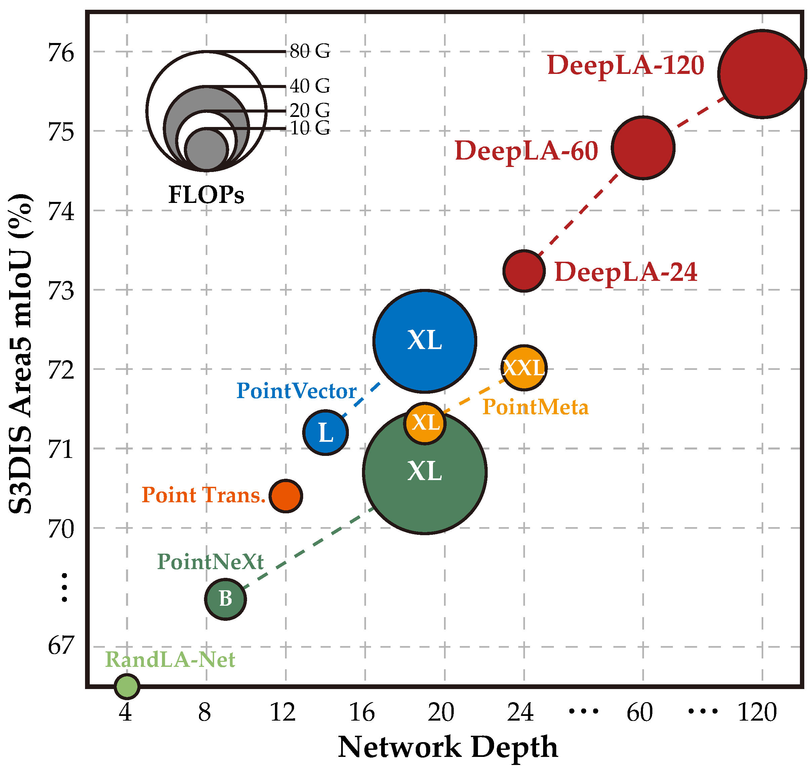
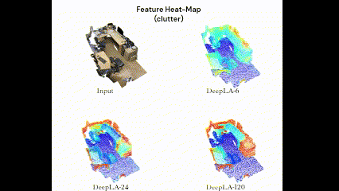
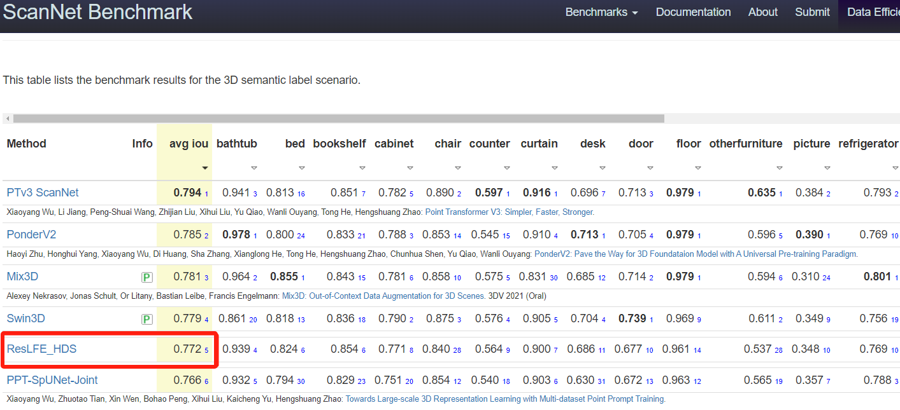
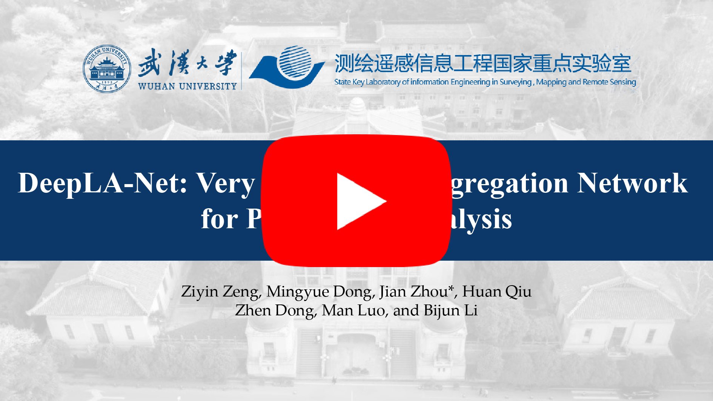

# DeepLA-Net: Very Deep Local Aggregation Networks for Point Cloud Analysis

Here is the PyTorch implementation of the paper **_DeepLA-Net: Very Deep Local Aggregation Networks for Point Cloud Analysis (CVPR 2025)_**. 

<div align='left'>


</div>

## Highlights
- *Feb, 2025*: DeepLA-Net is accepted at **CVPR 2025** :fire:!
- *May, 2024*: We released the Full Code and Pretrain Weights of S3DIS. And the next step will be released after receiving clear review comments.
- *Jan, 2024*: We released the model code of DeepLA-Net. 
- *Dec, 2023*: We released our project repo for DeepLA-Net, if you have any questions related to our work, please feel free to open an issue.

## Dependencies
- Ubuntu: 18.04 or higher
- PyTorch: 1.11.0 
- CUDA: 11.3 
- To create conda environment, command as follows:
  ```
  conda create -n deeplanet python=3.8
  conda activate deeplanet
  conda install pytorch==1.11.0 torchvision==0.12.0 torchaudio==0.11.0 cudatoolkit=11.3 -c pytorch
  conda install llvm-openmp
  conda install plyfile=0.8.1 scipy=1.10.1 h5py=3.8.0 ninja
  ```
- Install pointnet2_ops:
  ```
  cd utils/pointnet2_ops_lib/
  pip install .
  ```

## Data Preparation
### S3DIS
- Download S3DIS data by filling this [[here](http://buildingparser.stanford.edu/dataset.html)].
- Change the data path in the S3DIS/config file
- Run preprocessing code for S3DIS as follows:
  ```
  cd S3DIS
  python prepare_s3dis.py
  ```
- (Alternative) Our preprocess data can also be downloaded [[here](https://drive.google.com/file/d/1dU4ZpGp9glQQsGEK3bsQ9fsRbjKWA32V/view?usp=drive_link)], please agree the official license before download it.

## Train & Test
### S3DIS
- testing on S3DIS:
  ```
  python test.py
  ```
- S3DIS Area5 Segmentation Results.

| Year | Model | Val mIoU | Weights|
| :---: | :---: | :---: | :-----: |
| ICCV 2021 | PT v1 | 70.4% | - |
| NIPS 2022 | PointNeXt | 70.8% | - |
| CVPR 2023 | PointMeta | 72.0% | - |
| CVPR 2024 | PT v3 | 74.8% | - |
| 2024 | DeepLA-Net (Ours) | 75.8% | [[link](https://drive.google.com/drive/folders/1Cxfq5VTVWcvnD9SLIBfEDRlMFOoMEjzK?usp=sharing)] |

### ScanNet
- ScanNet Testset Segmentation Results. NO.1 among fully supervised methods, NO.5 among all methods. Note that, methods ranked before ours all used additional data for training.
- ResLFE_HDS means the two modules in our paper (Residual Local Feature Extraction "ResLFE" and Hybird Deep Supervision "HDS")
<p align="center">  </p>

## Demo
<p align="center"> <a href="https://youtu.be/kSZxvIsctQ4"></a> </p>

## Reference
If you find our work useful in your research, please consider citing:
```latex
@inproceedings{zeng2025deepla,
  title={DeepLA-Net: Very Deep Local Aggregation Networks for Point Cloud Analysis},
  author={Zeng, Ziyin and Dong, Mingyue and Zhou, Jian and Qiu, Huan and Dong, Zhen and Luo, Man and Li, Bijun},
  booktitle={IEEE/CVF Conference on Computer Vision and Pattern Recognition},
  year={2025}
}
```
