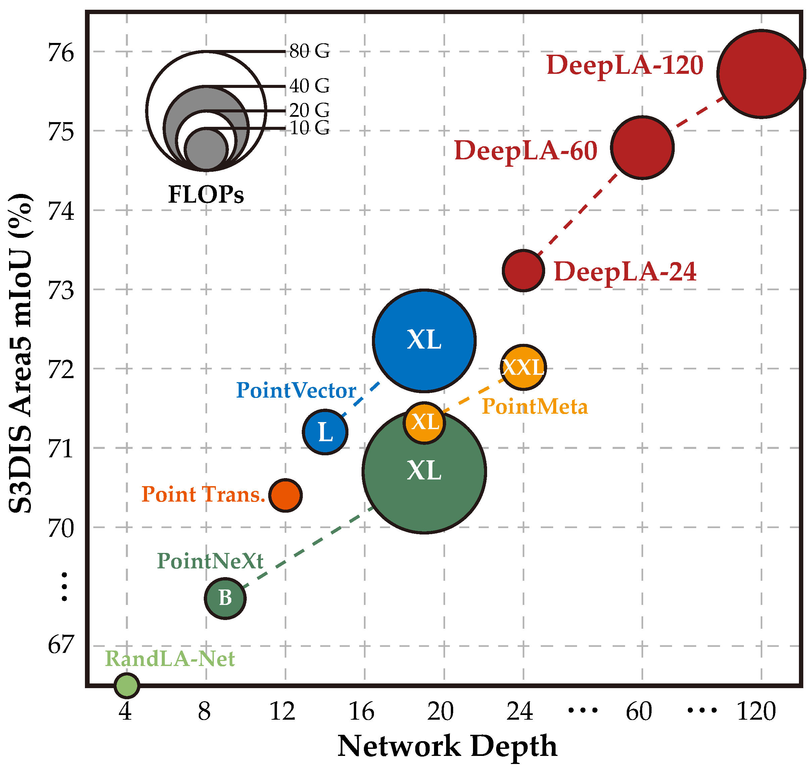
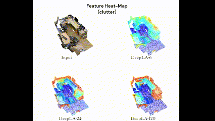

# DeepLA-Net: Very Deep Local Aggregation Networks for Point Cloud Analysis

Here is the PyTorch implementation of the paper **_Very Deep Local Aggregation Networks for Point Cloud Analysis_**. The current version only releases project repo. The full code will be coming soon.

<div align='left'>


</div>

## Highlights
- *Dec, 2023*: We released our project repo for DeepLA-Net, if you have any questions related to our work, please feel free to open an issue.

## Schedule
To make our polished code and reproduced experiments available as soon as possible, this time we will release what we already finished immediately after a validation instead of releasing them together after all work is done. We list a task list as follows:

- [ ] Release model code of DeepLA-Net;
- [ ] Release scratched config of semantic segmentation;
  - [ ] ScanNet
  - [ ] S3DIS
  - [ ] S3DIS 6-Fold (with cross-validation script)
- [ ] Release scratched config of object classification;
- [ ] Release scratched config of part segmentation;

## Dependencies
- Ubuntu: 18.04 or higher
- PyTorch: 1.11.0 
- CUDA: 11.3 
- To create conda environment, command as follows:
  ```
  conda install pytorch==1.11.0 torchvision==0.12.0 torchaudio==0.11.0 cudatoolkit=11.3 -c pytorch
  conda install llvm-openmp
  conda install plyfile=0.8.1 scipy=1.10.1 h5py=3.8.0
  ```
- Install pointnet2_ops:
  ```
  cd utils/pointnet2_ops_lib/
  pip install .
  ```
